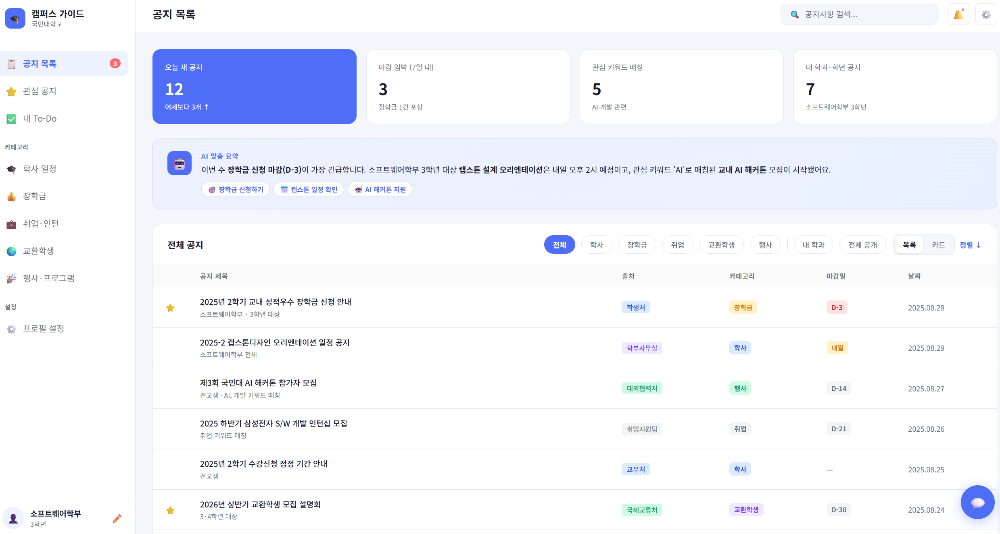
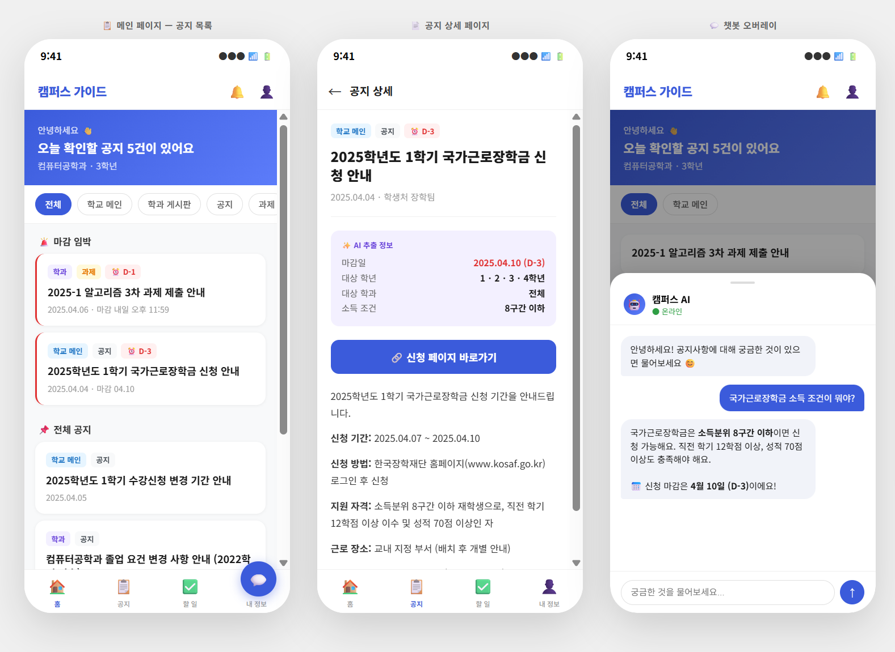

# 프론트엔드 아키텍처 설계 문서

---

## 1. 설계 목표

본 서비스의 프론트엔드 아키텍처는 AI 계층이 생성한 구조화된 공지 데이터와 개인화 결과물을 학생이 직관적으로 소비하고 즉각적으로 행동할 수 있는 인터페이스로 변환하는 것을 목표로 한다.

즉, 본 아키텍처의 목적은 단순한 정보 나열이 아니라, AI가 판단한 개인화 우선순위와 To-Do 변환 결과를 가장 자연스러운 방식으로 화면에 표현하고, 사용자가 추가적인 질문이 생겼을 때 챗봇 오버레이를 통해 즉각적인 답변과 원클릭 액션까지 연결되는 경험을 제공하는 것이다. 이를 위해 본 프론트엔드는 공지 열람 중심의 웹 페이지 계층과 AI 질의응답을 담당하는 챗봇 오버레이 계층을 분리하되, 하나의 서비스처럼 유기적으로 연결되는 구조로 설계한다.

---

## 2. 전체 구조 개요

본 서비스의 프론트엔드 아키텍처는 크게 5개 계층으로 구성된다.

```
[1] 라우팅 계층
    - URL 기반 페이지 전환 관리
    - 공지 목록 / 공지 상세 / 사용자 설정 라우팅

[2] 페이지·컴포넌트 계층
    - 공지 리스트 페이지
    - 공지 상세 페이지
    - 필터 UI (출처 / 카테고리 / 학년 / 학과)
    - 챗봇 오버레이 UI

[3] 상태 관리 계층
    - 서버 상태: API 응답 데이터 (공지 목록, 상세)
    - 클라이언트 상태: 필터 선택값, 챗봇 열림/닫힘 여부

[4] API 통신 계층
    - 백엔드 REST API 호출
    - AI 챗봇 API 호출
    - 요청/응답 공통 처리 (에러, 로딩, 재시도)

[5] 사용자 프로필 계층
    - 학년·학과·관심 키워드 등 개인 설정 저장
    - 로컬 저장 또는 백엔드 연동
```

이 구조에서 웹 페이지의 핵심은 [2]와 [3]이고, 챗봇 연동의 핵심은 [2]의 오버레이 UI와 [4]의 AI API 통신이다. 상태 관리를 서버 상태와 클라이언트 상태로 분리하면 API 캐싱과 자동 갱신을 효율적으로 처리할 수 있고, 챗봇 UI를 독립 컴포넌트로 분리하면 어느 페이지에서든 동일하게 동작하도록 관리할 수 있다.

---

## 3. 계층별 상세 설계

### 3.1 라우팅 계층

라우팅은 React Router v6를 기반으로 구성한다. URL 구조는 다음과 같다.

```
/                       공지 목록 메인 페이지
/notices/:id            공지 상세 페이지
/settings               사용자 프로필 설정 페이지
```

모든 페이지는 공통 레이아웃(Header 포함)을 공유하며, 챗봇 오버레이는 라우팅과 독립적으로 전체 페이지 위에 고정 렌더링된다. 이를 통해 사용자가 어느 페이지에 있든 챗봇을 항상 사용할 수 있다.

---

### 3.2 페이지·컴포넌트 계층

컴포넌트는 역할에 따라 세 단위로 분리한다.

**페이지 컴포넌트** — 라우팅 단위. API 호출 결과를 받아 하위 컴포넌트에 전달하는 역할만 담당한다.

**기능 컴포넌트** — 특정 기능을 담당하는 단위. 공지 목록(NoticeList), 공지 카드(NoticeCard), 필터 바(NoticeFilter), 챗봇 오버레이(ChatbotOverlay)가 이에 해당한다.

**공통 컴포넌트** — 여러 페이지에서 재사용되는 단위. 로딩 스피너, 에러 메시지, 뱃지 등이 이에 해당한다.

공지 카드(NoticeCard)는 AI 계층이 추출한 마감일, 대상 학년·학과 정보를 뱃지 형태로 표시하며, 해당 데이터가 없을 경우 자동으로 숨김 처리한다. 챗봇 오버레이(ChatbotOverlay)는 오른쪽 하단 버튼으로 열고 닫을 수 있으며, 열린 상태에서 사용자의 자연어 질문을 AI API로 전달하고 응답을 대화 형태로 표시한다.

---

### 3.3 상태 관리 계층

상태는 성격에 따라 두 종류로 분리한다.

**서버 상태** — 백엔드 API로부터 받아오는 데이터. TanStack Query(React Query)를 사용하며, 캐싱·로딩·에러·자동 갱신을 자동으로 처리한다. 공지 목록은 30초 간격으로 자동 갱신하여 크롤러가 수집한 최신 데이터를 실시간에 가깝게 반영한다.

**클라이언트 상태** — 화면 내 인터랙션 상태. React의 useState로 관리하며, 필터 선택값(출처, 카테고리)과 챗봇 창 열림/닫힘 여부가 이에 해당한다. 전역 상태 관리 라이브러리(Redux, Zustand 등)는 스프린트 1에서는 사용하지 않으며, 필요 시 추후 도입한다.

---

### 3.4 API 통신 계층

API 통신은 axios를 기반으로 구성하며, 모든 호출은 중앙 클라이언트 인스턴스를 통해 처리한다. 이를 통해 Base URL, 타임아웃, 공통 에러 처리를 한 곳에서 관리할 수 있다.

백엔드와의 통신은 공지 데이터 조회에 집중하며, 챗봇 오버레이는 AI 팀이 제공하는 별도 엔드포인트를 사용한다. 개발 초기에는 백엔드 API 완성 전까지 Mock 데이터를 활용하며, 환경 변수 전환만으로 실제 API로 교체할 수 있도록 설계한다.

```
백엔드 API    GET /notices           공지 목록 조회
              GET /notices/:id       공지 상세 조회

AI API        POST /chat             챗봇 질문 전송 및 응답 수신
```

---

### 3.5 사용자 프로필 계층

스프린트 1에서는 별도 로그인 없이, 사용자가 최초 접속 시 학과·학년을 선택하면 브라우저 로컬 스토리지에 저장하는 방식으로 구현한다. 이 정보는 공지 필터링 기본값과 챗봇 응답의 맥락 정보로 활용된다.

추후 로그인 기능이 도입되면, 로컬 스토리지 저장 방식을 백엔드 연동 방식으로 교체하며 프로필 계층의 인터페이스는 동일하게 유지한다.

---

## 4. 개발 단계

```
스프린트 1    공지 리스트 페이지 + 필터 UI + 백엔드 API 연동
    ↓
스프린트 2    챗봇 오버레이 UI + AI API 연동
    ↓
스프린트 3    사용자 프로필 기반 개인화 + To-Do 연동
```

---

## 5. 기술 스택

| 역할 | 기술 | 선택 이유 |
|---|---|---|
| UI 프레임워크 | React | 팀 경험 보유, 컴포넌트 재사용성 |
| 라우팅 | React Router v6 | React 표준, 간결한 API |
| 서버 상태 관리 | TanStack Query | 캐싱·자동갱신·에러 처리 자동화 |
| HTTP 통신 | axios | 공통 설정 및 에러 처리 편의성 |
| 스타일링 | Tailwind CSS | 빠른 UI 구성, 유지보수 용이 |

## 📸 화면 예시



